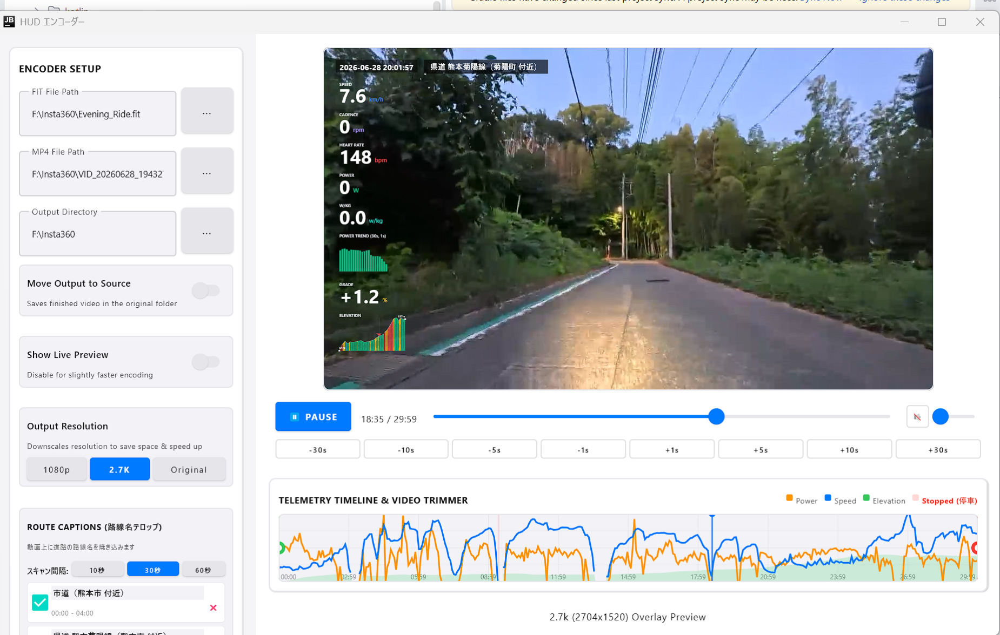

# FIT TRIMMER (フィットトリマー)

## これは何？

サイクリング動画に走行データ（GPSログ）をメーター風に重ね合わせて表示するHUD動画を作成する際、動画と走行ログのスタート位置を同期し、トリミングや合成処理を効率化するローカルツールです。

### 提供形態
* **デスクトップアプリ版 (Windows専用 / HUDエンコーダー搭載) [メイン]**: [Releases](https://github.com/YuujiKamura/fit-trimmer/releases) ページからビルド済みバイナリをダウンロードして使用できます。動画プレビュー再生等に Windows Media Foundation API を使用するため、Windows 専用です。スピードやパワー、心拍数などのHUDメーター情報を重ね合わせた動画を直接エンコード出力できます。
* **Webアプリ版 (FITファイルトリミング専用)**: [Web版ページ](https://yuujikamura.github.io/fit-trimmer/)。ブラウザ上で100%ローカルにFITファイルのみをトリミングできます。
* **100% ローカル処理**: ファイルを外部サーバーにアップロードしないため、個人情報の保護はもちろん、巨大な動画ファイルでも高速に処理できます。

---

## 主な機能 (デスクトップ版)

### 1. 走行データと動画の同期・トリミング
* **タイムアライメント (自動・手動同期)**:
  * **初期同期と大まかな手動合わせ**: 動画の撮影開始日時（UTC）とFITデータのタイムスタンプを照合して初期同期を行います。カメラの電池切れ等により内蔵時計が数十分以上大きくズレている場合でも、タイムライン上の「緑色の同期バー」をドラッグすることで、直感的におおよその同期位置を合わせることができます。
  * **IMU（加速度）によるズレ自動補正**: 動画内のカメラ加速度センサーログ（IMU）とFITデータの相関関係を解析し、時計の細かなズレ（数秒〜数十秒）を自動補正することも可能です（※IMU補正はセンサー品質や振動ノイズ等の影響を受けるため、確実な同期を保証するものではありません。必要に応じて手動での微調整と併用します）。
* **プレビュータイムライン**: GUI上で同期のズレをフレーム単位で手動微調整したり、出力するトリミング範囲をドラッグ操作で指定できます。
* **トリミングしたFITデータの出力**: 動画のトリミング範囲に合わせて、同期したFITファイルを切り出して出力します。

### 2. HUDメーター動画合成・高速エンコード
* **走行パラメーター・地図のオーバーレイ**: スピード、ケイデンス、パワー、心拍数、斜度、標高プロファイル（グラフ）、パワートレンド、および走行位置をリアルタイムにプロットするルートマップ（OpenStreetMap等の地図タイルを使用）を動画上に重ねて合成出力します。
* **GPUアクセラレーション対応**: H.264 ハードウェアエンコーダー（Intel QSV, NVIDIA NVENC, AMD AMF）を自動検出して利用し、高速にHUD動画を出力します。
* **手動分割・順次エンコード**: タイムライン上で手動で分割ポイントを指定し、分割された動画パートを順次エンコードして最終的にマージします。各パートの完了後に一時ファイルを自動クリーンアップするため、ローカルストレージの容量を節約できます。

### 3. バッチ処理とリカバリー
* **一括エンコード**: 複数の動画とFITデータのペアを登録し、順番に直列でエンコードを実行できます。
* **ジョブリカバリー**: アプリケーションがクラッシュや不意に強制終了した場合でも、中断されたバッチジョブから自動的に復旧して処理を再開できます。

### 4. プライバシーおよびインテリジェント機能 (試作・実験的機能)
* **ナンバープレート自動ぼかし (Plate Scan)**: 物体検出技術を使用して他車のナンバープレートを自動検出・追跡し、ぼかし処理を行います。走行速度に基づく誤検出防止フィルター（低速走行時のみスキャンなど）も備えています（※検出性能は完全ではなく、画角や光照条件の影響でぼかし漏れが発生する可能性があります）。
* **路線名自動テロップ (Road Scan)**: 国土地理院（GSI）のベクトルタイルから、走行中の路線名（国道、県道、市道等）を自動取得し、動画の字幕（テロップ）として焼き付けます。

### 5. Google Drive (仮想マウント) 対応
* クラウドストレージ上の巨大なファイルを処理する際、必要なトリミング区間だけを自動でローカルに一時ダウンロード（キャッシュ）し、ネットワーク遅延やI/Oエラーを回避します。

---

## 使い方

1. [Releases](https://github.com/YuujiKamura/fit-trimmer/releases) からビルド済みバイナリをダウンロードするか、リポジトリをクローンして `./gradlew :composeApp:run` で実行します。
2. 動画ファイルと `.fit` ファイルを選択します。
3. トリミング範囲やHUDのデザインを微調整し、「HUD動画を出力」または「バッチに追加」を実行します。

---

## 同期とトリミングの技術的仕組み

本ツールは協定世界時（UTC）をキーにして、動画と走行データを同期しています。

1. **動画メタデータの解析**: 動画ファイル（`moov -> mvhd`）の撮影開始日時（UTC）と録画時間をミリ秒単位で抽出します。
2. **FITデータのスライス**: 動画の撮影時間範囲に合致するレコードだけを切り出します。
3. **データの整合性修復**:
   * **距離のリスタート**: 開始地点での累積距離を 0 メートルとし、以降の距離データから初期オフセットを減算します。
   * **概要サマリーの書き換え**: セッションやラップの開始/終了時刻、走行時間、合計獲得距離などのサマリー情報を再計算して更新します。
   * **CRCとサイズの再計算**: データの整合性を修復し、ファイル破損エラーを防ぎます。

---

## ライセンス、プライバシーおよび外部通信ポリシー

### 1. 外部通信のタイミングとプライバシー
本ツールは原則として**100%ローカル環境**で動作し、動画や走行データを外部のサーバーにアップロードすることはありません。ただし、以下の機能を利用する場合のみ、必要な情報を取得するため外部APIとの通信が発生します。

* **地図タイルの取得**:
  プレビュー表示時またはエンコード処理時に、HUD上にルートマップ（地図）を描画する設定になっている場合、描画に必要なエリアの地図画像（タイル）をOpenStreetMap等の外部タイルサーバーから自動でバックグラウンド取得する通信が発生します（取得したタイルはローカルキャッシュに保存されます）。
* **登坂セグメント自動検出**:
  ユーザーがGUI上の「登坂セグメント自動検出」ボタンをクリックした際、読み込まれているFITデータの緯度・経度の範囲（BBox）を基に、OpenStreetMap（Overpass API）へ信号機や踏切の位置情報をクエリする通信が発生します。
* **路線名自動テロップ (Road Scan)**:
  「エンコード時に路線名を自動検出」の設定を有効にしてエンコード処理を実行した際、またはバッチジョブで `ROAD_SCAN` フェーズが動作する際に、GPSログからサンプリングされた座標位置の国県道・市道情報を特定するため、国土地理院のベクトルタイルサーバー（実験的道路中心線データ）へバックグラウンドでクエリする通信が発生します（1クエリあたり1秒程度の間隔制限を設けて順次リクエストします）。

### 2. サードパーティツールおよびライセンス
* **FFmpeg**:
  動画メタデータの解析、プレビュー用コピー、HUDメーター動画のエンコード処理に FFmpeg を使用します。本デスクトップアプリ版では、安定した動作を担保するため、実行環境に適合した FFmpeg バイナリがアプリ内にリソース（Windows版は `ffmpeg.zip`）として同梱されており、起動時に自動的に抽出・適用されます。この同梱されている FFmpeg バイナリは **GPL (GNU General Public License)** に基づいて配布されています。

### 3. 本ソフトウェアのライセンスおよびポリシー
* 本ソフトウェア（FIT TRIMMER）は、GPLでライセンスされたバイナリを同梱して配布するため、**GNU General Public License v3 (GPLv3)** に基づいて公開・配布されるオープンソースソフトウェアです。
* 本リポジトリのプログラムは、開発や動作検証のための試作機能（ナンバープレート自動ぼかし、路線名検出など）を多数含んでいます。
* ナンバープレート自動ぼかし（Plate Scan）の検出性能は完全ではなく、画角や周囲の明るさによってぼかし漏れが発生する可能性があります。
* 本ソフトウェアを使用したことによって生じたいかなる損害（動画出力の失敗、プライバシー情報の漏洩、データの破損など）についても、開発者は一切の責任を負いません。最終的な成果物のぼかし漏れの有無などは、必ずユーザー自身で目視確認を行ってください。
