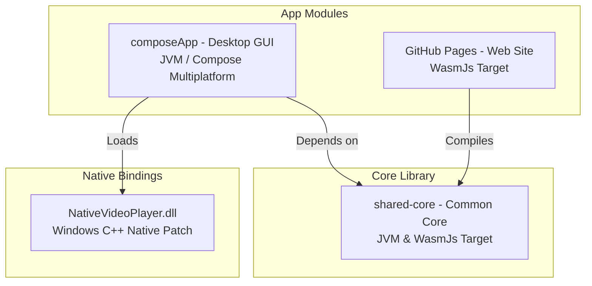

# FIT TRIMMER 内部技術仕様書 (ARCHITECTURE.md)

本ドキュメントは、**FIT TRIMMER (フィットトリマー)** プロジェクトの内部設計、技術スタック、アーキテクチャ、および過去の開発上の重要決定事項をまとめた開発者向けリファレンスです。

---

## 1. モジュール設計とシステム構成

プロジェクトは **Kotlin Multiplatform (KMP)** および **Compose Multiplatform** で構築されており、コード共有率を最大化しながらデスクトップ (JVM) と Web (WasmJs) の両プラットフォームで動く構成となっています。



### モジュール役割分担
*   **[:shared-core](file:///C:/Users/yuuji/fit-trimmer/shared-core):**
    *   共通ビジネスロジック。プラットフォーム固有のUI描画やI/Oを極力排除し、純粋なデータ処理に特化しています。
    *   **ターゲット:** `jvm("desktop")` および `wasmJs`
*   **[:composeApp](file:///C:/Users/yuuji/fit-trimmer/composeApp):**
    *   デスクトップ (Windows/macOS) 向けの GUI アプリケーション。
    *   **ターゲット:** `jvm("desktop")` (Compose Multiplatform によるデスクトップ描画)

---

## 2. 走行データ解析と同期エンジン (`shared-core`)

動画ファイルの撮影開始時刻と走行データ (FITファイル) の時刻情報をバイトレベルでスキャンし、精密に同期トリミングします。

```
[MP4 Video File]  ---> Scan moov/mvhd ---> Get Start UTC (e.g., 10:00:00Z) + Duration (10 min)
                                                          |
                                                          v (Overlap Align)
[Garmin .fit File] ---> Scan FIT Records ---> Crop range [10:00:00Z ~ 10:10:00Z]
                                                          |
                                                          v (Data Repair)
                                             - Distance Reset (Start from 0m)
                                             - Summary Rewrite (Laps/Stats)
                                             - Recalculate CRC-16 Checksum
```

### `FitParser`
*   **処理内容:** Garmin のバイナリデータ形式 (FIT) を純 Kotlin で解析・編集します。
*   **データ補正 (修復機能):**
    1.  **累積距離の初期化:** トリミング開始地点での累積走行距離を `0` メートルとし、以降の各レコードから初期オフセットを差し引くことで、メーター表示が途中から開始するのを防ぎます。
    2.  **サマリーの書き換え:** セッション全体 (`session`) やラップ (`lap`) の開始/終了時刻、平均速度、獲得標高、合計距離などのメタデータを、切り出し後の実データに基づいて再計算し更新します。
    3.  **CRC-16とサイズの修復:** レコード削減によって変動したバイトサイズおよび全体の CRC-16 チェックサムを再計算し、Garmin Connect や Strava へのアップロード時に「破損ファイル」と判定されるのを防ぎます。

### `Mp4Parser`
*   **処理内容:** 動画ファイルのメタデータアトム (`moov -> mvhd`) をバイト配列から直接スキャンし、撮影開始日時 (UTC) と動画秒数をミリ秒単位で高速に抽出します。
*   **Moov-at-Tail 対応:**
    *   通常、`moov` アトムは動画の先頭にありますが、一部の録画環境ではファイルの末尾に書き込まれる場合があります。このケースに対応するため、ファイルの先頭部スキャンで `moov` が見つからなかった場合は、ファイル末尾からの逆方向シークおよび部分スキャンを実行してメタデータを引き出します。

---

## 3. 動画プレイヤー & オーディオ制御 (`composeApp`)

軽量化とシークのスムーズ化を達成するため、**VLC への外部依存を完全に廃止**し、Windows Media Foundation (WMF) ベース of [composemediaplayer](https://github.com/kdroidfilter/composemediaplayer) 構成へと移行しました。

### 音声シークパッチ (`NativeVideoPlayer.dll`)
Windows 上で動画のシーク（スキップ）や再生・一時停止を繰り返すと、スピーカーから「プツッ」というノイズ（オーディオグリッチ）が発生する現象を解決するため、カスタムの C++ ネイティブライブラリによる制御パッチを導入しています。

| 課題 | 解決アプローチ |
| :--- | :--- |
| **シーク時のバッファ枯渇ノイズ** | シーク時に WASAPI のオーディオバッファをゼロ（無音データ）でプリフィル（事前充填）し、バッファ切れに伴う瞬間的な矩形波ノイズを物理的に抑制。 |
| **サンプリング周波数の不整合** | デバイス側サンプリングレートとソース側の動的リサンプリング処理を同期化し、再生開始・停止時の歪みを解消。 |
| **リアルタイム音量制御** | `GetAudioLevels` 関数のネイティブ実装をバインドし、UIからのミュートおよび音量スライダー操作と低レイヤーの音声ゲインを直接同期。 |

---

## 4. エンコード & クラッシュリカバリー (`shared-core`)

[NativeHudEncoder](file:///C:/Users/yuuji/fit-trimmer/shared-core/src/desktopMain/kotlin/NativeHudEncoder.kt) は、FFmpeg のバイナリを内包し、動画上にメーター情報 (HUD) をオーバーレイ合成して新しい動画を出力するエンコードエンジンです。

### クラッシュリカバリー (レジューム機能)
長時間の 4K 動画などのエンコード中に PC がスリープしたりクラッシュした場合に備え、独自のセグメント分割エンコードと自動復旧処理を備えています。

```
[Start Encoding]
       |
       +---> [Check Temp Work Directory]
       |            |
       |            +---> (Found existing chunks: part_0001.ts, part_0002.ts...)
       |            +---> Read total duration of complete chunks (e.g., 240s)
       |            |
       v            v
[Encode Loop] Resume from 240s 
       |
       +---> Generate overlay frames via Compose / Skia Graphics
       |
       +---> Write raw frame bytes to FFmpeg pipe (H.264 hardware encoding: QSV/NVENC/AMF)
       |
       +---> Output temporary TS segment (e.g., part_0003.ts)
       |
[Finished All Chunks]
       |
       +---> Mux / Concat all TS files instantly via FFmpeg's concat protocol (No re-encoding)
       +---> Clean up temporary work directory
```

*   **精密な復旧オフセット計算:**
    再起動時には、既存の `.ts` チャンクファイルから `getSegmentDuration` ヘルパーを用いて正確な合計秒数（ミリ秒単位）を逆算します。これにより、再開ポイントの重複やギャップが発生せず、結合後の動画・音声の音ズレや映像の乱れを完全にゼロにします。
*   **CPU スケジューリング優先度:**
    Windows 環境下でのエンコード実行時は、親プロセスからフォークされた `ffmpeg.exe` プロセスの優先度クラス (Priority Class) を自動的に `High (高)` に設定し、他のバックグラウンド処理に阻害されず安定したスループットを維持します。

---

## 5. クロスプラットフォーム設計

Windows と Mac (および Linux) の各OS環境でそのままダブルクリック起動してスタンドアロンで動作するよう、徹底したプラットフォーム抽象化が行われています。

### システムディスク・空き容量モニター
エンコード作業には一時ファイルとして膨大なディスク容量（RAWフレームバッファの一時保存など）が必要です。容量不足によるエンコード失敗を防ぐため、サイドバーに容量モニターカードを配置しています。

*   **動的なマウントパス解決:**
    実行中のOS環境情報を判別し、Windows の場合は `C:\` ドライブ、Mac/Linux の場合はルートディレクトリ `/` を自動検出してディスク使用量を追跡します。
    ```kotlin
    val isWindows = System.getProperty("os.name").lowercase().contains("win")
    val file = if (isWindows) File("C:\\") else File("/")
    ```
*   **UIラベルの切り替え:**
    Windows 以外のOSでは、カードタイトルが自動的に `SYSTEM DISK MONITOR` へ切り替わり、違和感のないUI表示を提供します。

### 外部依存ゼロ（自己完結型パッケージ）
*   **FFmpeg バイナリの動的展開:**
    PCの環境変数に FFmpeg のパスが通っていなくても動くよう、ビルド時に FFmpeg をリソースとして ZIP 圧縮してアプリ内に内包。アプリの初回起動時にバックグラウンドで自動展開され、アプリ専用の一時ディレクトリから直接実行される仕組みをとっています。
*   **JRE の内包:**
    JVM 向けの Compose アプリケーションですが、パッケージング時に専用の JRE が切り出されてインストーラーに同封されるため、ユーザーが JDK や Java ランタイムを別途用意する必要はありません。

---

## 6. CI/CD 自動化パイプライン

GitHub Actions を用いて、コード修正の反映と各種パッケージのビルドが自動化されています。

1.  **GitHub Pages (Web アプリ版) のデプロイ:**
    *   `main` ブランチへのプッシュをトリガーに、Kotlin/Wasm ビルド (`:shared-core:wasmJsBrowserDistribution`) が走り、生成された Wasm/JS アセットを `Deploy to GitHub Pages` を通じて静的サイトとして公開します。
    *   ビルド時の Wasm コンパイルと `kotlinx-serialization` のメタデータ競合を回避するため、`kotlinx-browser` のバージョンは Kotlin 2.1.x 系列と完全に整合する `0.3` を固定使用しています。
2.  **デスクトップアプリ版 (Windows / macOS) のリリース:**
    *   `v*` (例: `v1.0.0`) のタグプッシュをトリガーに、Windows 用の MSI インストーラー (`:composeApp:packageMsi`) および macOS 用の DMG ディスクイメージ (`:composeApp:packageDmg`) をそれぞれの OS ランナー上でクロスビルドします。
    *   ビルド成功後、`softprops/action-gh-release` を使用して GitHub の該当タグの Releases ページに各インストーラーがアセットとして自動配置されます。
