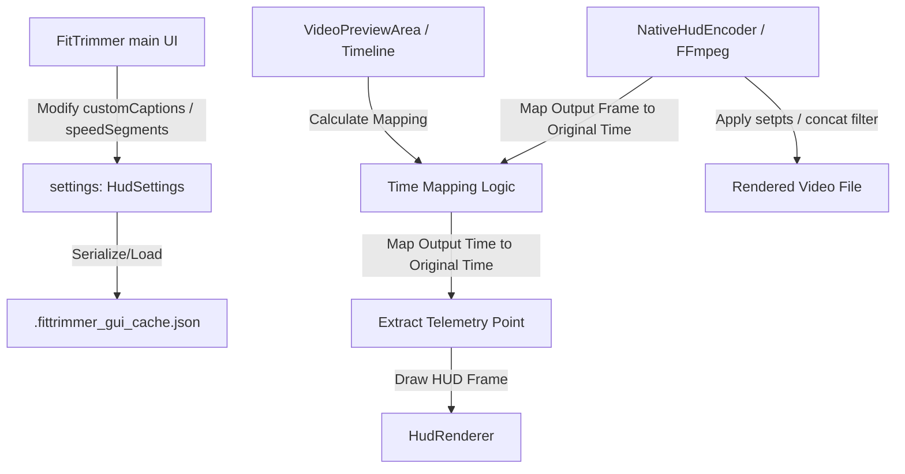

# Design Specification: Manual Custom Captions & Section Timelapse (Speed Segments)

- Date: 2026-07-03
- Version: 1.0.0
- Target Milestone: Next Release (v1.31.0+)

---

## 1. Background & Purpose
Currently, FitTrimmer only overlays telemetry HUD data and automatically generated road names. For viewers of riding videos, additional contextual details (e.g. slopes, warning zones, commentary) and timelapse/fast-forwarding of monotonous uphill sections are required to keep the video engaging. 
This document specifies the architecture, data models, and UI changes to support **Manually Added Custom Captions** and **Section-based Playback Speed Control (Timelapse Segments)**.

---

## 2. Architecture & Data Flow



---

## 3. Manual Custom Captions Specification

To prevent automatic road-name detection from overriding or corrupting manually added text overlays, custom captions are stored in a dedicated list independent of `roadCaptions`.

### 3.1. Data Model
A new data model `CustomCaptionSegment` is introduced inside the common module:

```kotlin
package fit

import kotlinx.serialization.Serializable

@Serializable
data class CustomCaptionSegment(
    val id: String,
    val startSeconds: Double,
    val endSeconds: Double,
    val text: String,
    val isEnabled: Boolean = true,
    val fontSize: Float = 24f,
    val fontColorHex: String = "#FFFFFF",
    val bgColorHex: String = "#000000",
    val position: String = "bottom_center" // Options: "bottom_center", "top_center", "top_left", "top_right"
)
```

Added property to `HudSettings`:
```kotlin
val customCaptions: List<CustomCaptionSegment> = emptyList()
```

### 3.2. Rendering Logic (`HudRenderer.kt`)
* Check for active custom captions based on the mapped original seconds:
  ```kotlin
  val activeCustom = config.customCaptions.find {
      it.isEnabled && currentSeconds >= it.startSeconds && currentSeconds <= it.endSeconds
  }
  ```
* Overlay rendering parameters:
  * Default position: `bottom_center` (underneath the main HUD).
  * Appearance variables (text size, box opacity, Hex colors) are parsed per caption dynamically.

### 3.3. UI Panel
* A new tab named **"Captions"** is added next to the existing **"File"**, **"Edit"**, and **"Settings"** tabs.
* Features:
  * **"Add Caption at Current Playhead"** button: inserts a new segment with `startSeconds` preset to the current video playback position.
  * Scrollable list of custom captions with editable text fields, start/end time text input, size/color selectors, and a delete button.

---

## 4. Timelapse / Speed Segments Specification

Users can specify sections of the video to speed up (e.g. 4x speed for climbing uphill) to avoid long boring periods.

### 4.1. Data Model
```kotlin
package fit

import kotlinx.serialization.Serializable

@Serializable
data class SpeedSegment(
    val id: String,
    val startSeconds: Double,  // Original timeline start time (seconds)
    val endSeconds: Double,    // Original timeline end time (seconds)
    val speedMultiplier: Double // Options: 2.0, 4.0, 8.0, 1.0 (defaults to 1.0)
)
```

Added property to `HudSettings`:
```kotlin
val speedSegments: List<SpeedSegment> = emptyList()
```

### 4.2. Timeline Mapping Logic
Since sections of the video are sped up, the duration of the final output video is compressed. We must calculate the non-linear relationship between the output video time and the original FIT/Video time.

#### Time Translation Algorithm (`shared-core/src/commonMain/kotlin/fit/SpeedMapper.kt`)
```kotlin
package fit

object SpeedMapper {
    fun getOriginalTimeSeconds(outputSeconds: Double, segments: List<SpeedSegment>, videoDuration: Double): Double {
        val sorted = segments.sortedBy { it.startSeconds }
        var currentOutputTime = 0.0
        var currentOriginalTime = 0.0

        for (seg in sorted) {
            // Process standard speed (1x) chunk before this segment
            if (seg.startSeconds > currentOriginalTime) {
                val chunkOriginal = seg.startSeconds - currentOriginalTime
                val chunkOutput = chunkOriginal
                if (outputSeconds <= currentOutputTime + chunkOutput) {
                    val ratio = (outputSeconds - currentOutputTime) / chunkOutput
                    return currentOriginalTime + ratio * chunkOriginal
                }
                currentOutputTime += chunkOutput
                currentOriginalTime = seg.startSeconds
            }

            // Process speed segment chunk
            val chunkOriginal = seg.endSeconds - seg.startSeconds
            val chunkOutput = chunkOriginal / seg.speedMultiplier
            if (outputSeconds <= currentOutputTime + chunkOutput) {
                val ratio = (outputSeconds - currentOutputTime) / chunkOutput
                return currentOriginalTime + ratio * chunkOriginal
            }
            currentOutputTime += chunkOutput
            currentOriginalTime = seg.endSeconds
        }

        // Process remaining standard speed (1x) chunk
        if (currentOriginalTime < videoDuration) {
            val chunkOriginal = videoDuration - currentOriginalTime
            val chunkOutput = chunkOriginal
            if (outputSeconds <= currentOutputTime + chunkOutput) {
                val ratio = (outputSeconds - currentOutputTime) / chunkOutput
                return currentOriginalTime + ratio * chunkOriginal
            }
        }
        return videoDuration
    }
}
```

### 4.3. UI Panel
* Configured under the **"Edit"** tab in a new collapsible card named **"Playback Speed & Timelapse Segments"**.
* Users can input speed segments by defining start/end bounds and selecting the multiplier (e.g. 2x, 4x, 8x).

### 4.4. FFmpeg Video & Audio Filter Generation
To speed up video portions while maintaining audio continuity elsewhere:
* **Video Filter**: Generate a complex filter graph utilizing `trim` and `setpts` filters:
  ```
  [0:v]trim=start=0:end=10,setpts=PTS-STARTPTS[v0];
  [0:v]trim=start=10:end=50,setpts=0.25*(PTS-STARTPTS)[v1];
  [v0][v1]concat=n=2:v=1:a=0[outv]
  ```
* **Audio Filter**: To avoid high-pitched squealing or visual mismatch, audio is completely muted during speed segments:
  * Extract audio only from normal speed (1x) sections.
  * Stitch (concat) normal speed audio segments, leaving sped-up segments completely silent.

---

## 5. Test Strategy
1. **Speed Mapping Unit Tests**: Create `SpeedMapperTest.kt` verifying non-linear time conversion edge-cases (segments boundary, empty segments list, invalid multipliers).
2. **FFmpeg Filter Generation Tests**: Verify that `NativeHudEncoder` outputs the correct filter string for complex multiple speed segments configurations.
